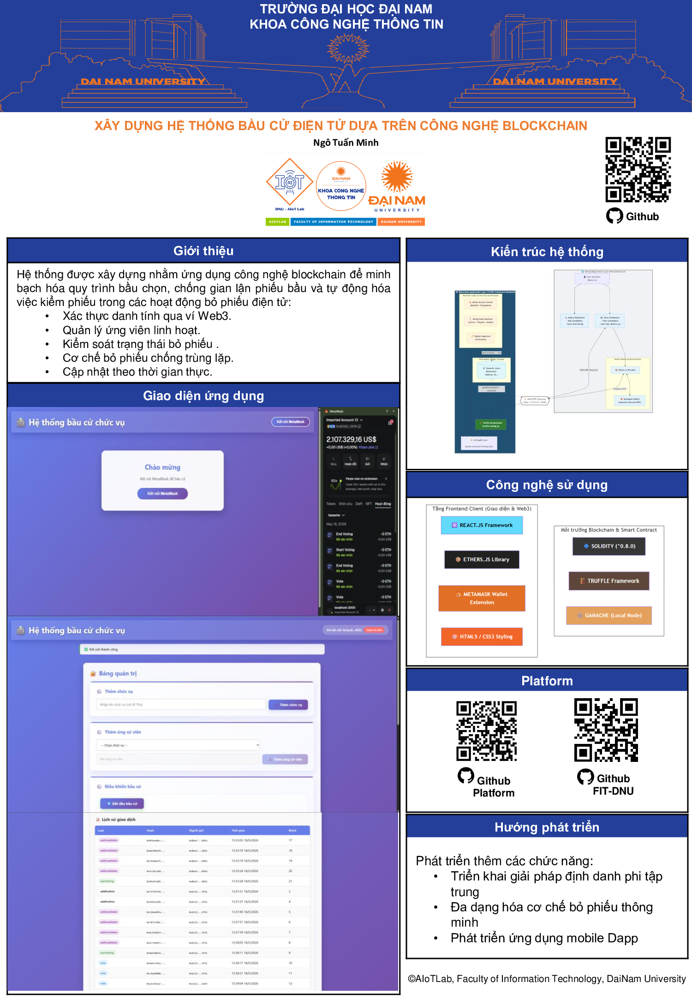

<h1 align="center">
🗳️ Hệ Thống Bỏ Phiếu Điện Tử Phi Tập Trung (Voting DApp)
</h1>
<div align="center">
  
</div>
<br>
<div align="center">

[](https://ethereum.org/)
[](https://ethereum.org/)
[](https://solidity-lang.org/)

</div>

<hr>

<h2 align="center">✨ Mô tả dự án</h2>
<p align="justify">
  Đây là dự án xây dựng <strong>Hệ Thống Bỏ Phiếu Điện Tử Phi Tập Trung (Voting DApp)</strong> sử dụng <strong>Blockchain Ethereum</strong> với <strong>Smart Contract Solidity</strong>, <strong>React Frontend</strong> và <strong>Node.js Express Backend</strong>. Hệ thống cho phép Admin quản lý cuộc bầu chọn, thêm ứng cử viên, và cử tri có thể bầu chọn một cách an toàn và minh bạch thông qua ví MetaMask.
</p>

<hr>

<h2 align="center">🚀 Cấu trúc dự án</h2>
<pre>
📂 voting-dapp/
├── 📁 contracts/                # Smart Contracts Solidity
│   ├── 🔐 Voting.sol           # Contract quản lý bầu chọn
│   └── 🔐 RiceDiseaseRecord.sol # Contract ghi nhận bệnh
├── 📁 migrations/              # Truffle migration files
│   ├── 📝 1_initial_migration.js
│   ├── 📝 2_deploy_voting.js
│   └── 📝 3_deploy_rice_disease_record.js
├── 📁 src/                      # React Frontend
│   ├── ⚛️ App.js               # Main React component
│   ├── 🎨 App.css              # Styling
│   ├── 📄 index.js             # React entry point
│   ├── 📄 index.html           # HTML template
│   └── 📋 VotingABI.json       # Contract ABI
├── 📁 public/                   # Static assets
│   ├── 📄 index.html           # Main HTML
│   └── 🎨 style.css            # CSS chung
├── 📁 build/                    # Compiled contracts
│   └── 📁 contracts/
│       ├── 📦 Voting.json
│       └── 📦 RiceDiseaseRecord.json
├── 📁 test/                     # Test files
│   └── 🧪 voting.test.js       # Unit tests
├── 📜 server.js                # Express Backend (Port 5000)
├── ⚙️ truffle-config.js        # Truffle configuration
├── 📦 package.json             # Dependencies
└── 📘 README.md                # Documentation
</pre>

<hr>

<h2 align="center">🎯 Công Nghệ Sử Dụng</h2>

### 🔗 Blockchain & Smart Contracts

<div align="center">

[](#)
[](#)
[](#)
[](#)

### 💻 Frontend

[](#)
[](#)
[](#)
[](#)
[](#)

### 🔌 Backend

[](#)
[](#)
[](#)
[](#)

### 🛠️ Development Tools

[](#)
[](#)
[](#)

</div>

<hr>

<h2 align="center">📦 Cài Đặt & Khởi Chạy</h2>

### 1️⃣ Cài Đặt Dependencies

```bash
npm install
```

### 2️⃣ Khởi Chạy Ganache (Local Blockchain)

#### Tùy Chọn A: Ganache GUI
- Tải từ [Ganache official site](https://www.trufflesuite.com/ganache)
- Mở Ganache GUI
- Đảm bảo kết nối trên **127.0.0.1:7545**

#### Tùy Chọn B: Ganache CLI
```bash
npm install -g ganache
ganache --port 7545
```

### 3️⃣ Compile Smart Contract

```bash
truffle compile
```

**Kết quả**: Tạo folder `build/contracts/` chứa ABI của contract.

### 4️⃣ Deploy Smart Contract

```bash
truffle migrate --network development
```

**Lưu ý**: Sao chép địa chỉ contract được in ra và cập nhật vào `src/App.js`:

```javascript
const VOTING_CONTRACT_ADDRESS = '0x...'; // Địa chỉ từ output migrate
```

### 5️⃣ Cấu Hình MetaMask

1. Mở **MetaMask Extension**
2. Click vào **Network dropdown** → **Add Network**
3. Nhập thông tin:
   - **Network Name**: `Ganache`
   - **New RPC URL**: `http://127.0.0.1:7545`
   - **Chain ID**: `5777`
   - **Currency Symbol**: `ETH`
   - Click **Save**

4. **Import Private Key** từ Ganache:
   - Mở Ganache, click icon key tài khoản đầu tiên
   - Copy private key
   - MetaMask: Menu → **Import Account** → paste private key

### 6️⃣ Chạy Express Backend (Port 5000)

```bash
npm run server
```

### 7️⃣ Chạy Frontend (Port 3000)

Mở terminal mới:

```bash
npm start
```

Hoặc chạy cả Frontend và Backend cùng lúc:

```bash
npm run dev
```

**Kết quả**: Ứng dụng mở tại `http://localhost:3000`

<hr>

<h2 align="center">🎮 Hướng Dẫn Sử Dụng</h2>

### 👨‍💼 Dành cho Admin

1. **Connect MetaMask**
   - Kết nối ví MetaMask của bạn
   - Đảm bảo dùng tài khoản admin (tài khoản đầu tiên từ Ganache)

2. **Add Position** (Thêm Chức Vụ)
   - Nhập tên chức vụ (vd: "Chủ tịch", "Phó chủ tịch")
   - Nhấn "Add Position"

3. **Add Candidate** (Thêm Ứng Cử Viên)
   - Chọn chức vụ từ dropdown
   - Nhập tên ứng cử viên
   - Nhấn "Add Candidate"

4. **Start Voting** (Bắt Đầu Bầu Chọn)
   - Nhấn nút "Start Voting"
   - Cử tri giờ có thể bầu chọn

5. **End Voting** (Kết Thúc Bầu Chọn)
   - Nhấn nút "End Voting"
   - Xem kết quả cuối cùng

### 🗳️ Dành cho Cử Tri

1. **Connect MetaMask**
   - Kết nối ví MetaMask của bạn

2. **Xem Danh Sách Chức Vụ & Ứng Cử Viên**
   - Giao diện hiển thị tất cả chức vụ
   - Dưới mỗi chức vụ là danh sách ứng cử viên

3. **Bầu Chọn**
   - Nhấn nút "Vote" cho ứng cử viên ưa thích
   - Xác nhận giao dịch qua MetaMask (ký transaction)
   - Chỉ có thể bầu **1 lần** cho mỗi chức vụ

4. **Kiểm Tra Kết Quả**
   - Xem số phiếu bầu thực tế ngay lập tức
   - Kết quả được lưu trên Blockchain

<hr>

<h2 align="center">✨ Chức Năng Chính</h2>

### 📝 Smart Contract Functions (Voting.sol)

| Hàm | Mô Tả | Quyền |
|-----|-------|-------|
| `addPosition(name)` | Thêm chức vụ bầu chọn mới | Admin |
| `addCandidate(positionId, name)` | Thêm ứng cử viên cho chức vụ | Admin |
| `startVoting()` | Bắt đầu cuộc bầu chọn | Admin |
| `endVoting()` | Kết thúc cuộc bầu chọn | Admin |
| `vote(candidateId)` | Bầu chọn cho ứng cử viên | Cử tri |
| `getAllPositions()` | Lấy danh sách chức vụ | Công khai |
| `getCandidates(positionId)` | Lấy ứng cử viên của chức vụ | Công khai |
| `hasVoted(address, positionId)` | Kiểm tra đã bầu chưa | Công khai |
| `getVoteCounts(candidateId)` | Lấy số phiếu ứng cử viên | Công khai |

### 🎯 Frontend Features

✅ Kết nối MetaMask  
✅ Hiển thị danh sách chức vụ & ứng cử viên  
✅ Giao diện bầu chọn thân thiện  
✅ Hiển thị số phiếu real-time  
✅ Bảng điều khiển Admin  
✅ Kiểm tra trạng thái bầu chọn  
✅ Xác nhận giao dịch qua MetaMask  
✅ Backend lưu trữ & audit trail  

### 🔌 Backend API (Express Server - Port 5000)

| Endpoint | Method | Mô Tả |
|----------|--------|-------|
| `/api/save-transaction` | POST | Lưu transaction trước blockchain |
| `/api/update-transaction` | POST | Cập nhật transaction với blockchain info |

<hr>

<h2 align="center">⛓️ Luồng Hoạt Động Hệ Thống</h2>

```
┌─────────────┐
│   User      │
│  MetaMask   │
└──────┬──────┘
       │ 1. Connect & Auth
       ▼
┌──────────────────────┐
│   React Frontend     │  2. Load Contract Data
│   (Port 3000)        │◄─────────────┐
└──────┬───────────────┘              │
       │ 3. Sign & Send Tx            │
       ▼                              │
┌──────────────────────┐              │
│   Ethers.js          │              │
│ (Blockchain Library) │              │
└──────┬───────────────┘              │
       │ 4. Execute Function          │
       ▼                              │
┌──────────────────────┐              │
│  Ganache             │              │
│ (Local Blockchain)   │              │
│   Port 7545          │──────────────┘
└──────┬───────────────┘
       │ 5. Contract State & Events
       ▼
┌──────────────────────┐
│  Smart Contract      │
│   Voting.sol         │
└──────┬───────────────┘
       │ 6. Save Transaction Data
       ▼
┌──────────────────────┐
│  Express Backend     │
│  (Port 5000)         │
└──────┬───────────────┘
       │ 7. Write to File
       ▼
┌──────────────────────┐
│   data.json          │
│ (Transaction Log)    │
└──────────────────────┘
```

**Quy trình chi tiết:**
1. Admin/User kết nối MetaMask
2. React app tải dữ liệu smart contract từ Ganache
3. Admin thêm chức vụ & ứng cử viên → ký transaction
4. Ethers.js gửi transaction → Smart Contract → Ganache xử lý
5. React cập nhật UI → gọi API backend
6. Express backend lưu transaction data vào `data.json`
7. User bầu chọn → quy trình tương tự
8. Kết quả được lưu trên blockchain & backend

<hr>

<h2 align="center">🧪 Test Smart Contract</h2>

```bash
truffle test
```

<hr>

<h2 align="center">🔧 Troubleshooting</h2>

| Lỗi | Nguyên Nhân | Giải Pháp |
|-----|-----------|----------|
| "Contract address is not found" | Contract chưa deploy | Chạy `truffle migrate --network development` |
| "Could not connect to Ganache" | Ganache không chạy | Khởi chạy Ganache trên port 7545 |
| "MetaMask not found" | Extension không cài | Cài MetaMask extension từ Chrome Web Store |
| "Only admin can call this function" | Dùng tài khoản sai | Import private key tài khoản admin từ Ganache |
| "You already voted" | Đã bầu cho chức vụ này | Mỗi chức vụ chỉ bầu 1 lần |
| "Voting is not started" | Cuộc bầu chưa bắt đầu | Admin phải nhấn "Start Voting" |

<hr>

<h2 align="center">📚 Tài Liệu Tham Khảo</h2>

- [Truffle Suite Docs](https://trufflesuite.com/docs)
- [Solidity Documentation](https://docs.soliditylang.org)
- [Ethers.js Documentation](https://docs.ethers.org)
- [MetaMask Docs](https://docs.metamask.io)
- [Express.js Guide](https://expressjs.com/)
- [React Documentation](https://react.dev)

<hr>

<h2 align="center">📄 License</h2>

MIT License - Xây dựng cho bài tập lớp

<hr>

<h2 align="center">👨‍💻 Tác Giả & Thành Viên Nhóm</h2>

<center>
<table>
  <thead>
    <tr>
      <th>Họ và Tên</th>
      <th>Mã Sinh Viên</th>
      <th>Vai Trò</th>
    </tr>
  </thead>
  <tbody>
    <tr>
      <td>Ngô Tuấn Minh</td>
      <td>1571020175</td>
      <td>Phát triển dự án</td>
    </tr>
  </tbody>
</table>
</center>

<center>

### 📖 Giảng Viên Hướng Dẫn

**TS. Trần Đăng Công**

</center>

<hr>

<p align="center">
  © 2025 - Voting DApp Project<br>
  <strong>Hệ Thống Bỏ Phiếu Điện Tử Phi Tập Trung</strong><br>
  Blockchain Ethereum × Smart Contracts × React × Node.js
</p>


